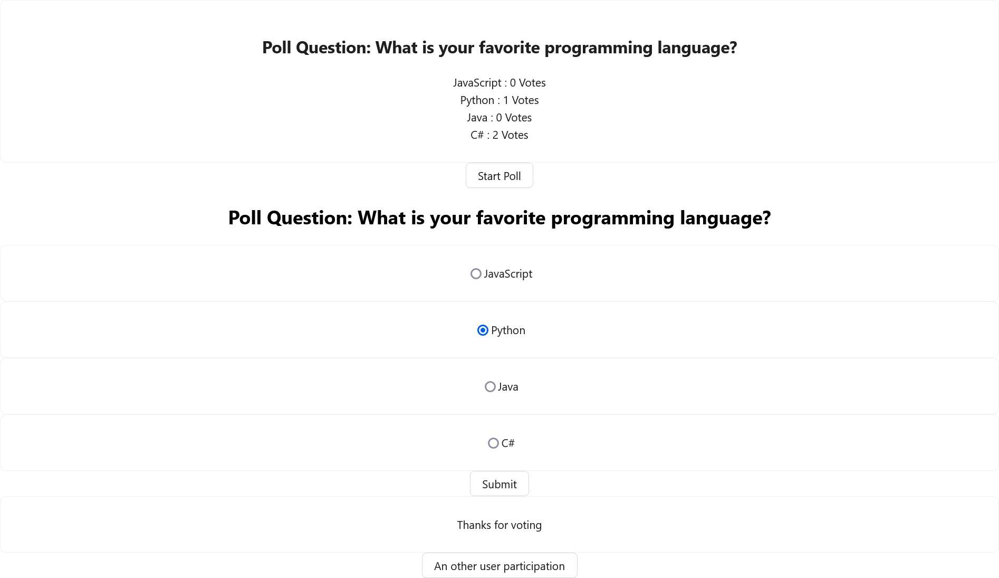

# Poll App



## App Component

```jsx
import React, { useState } from "react";
import "./App.css";
import PollDisplay from "./PollDisplay";
import UserParticipation from "./UserParticipation";
import ThankYouMessage from "./ThankYouMessage";
import AnotherUserParticipation from "./AnotherUserParticipation";

import { Button } from "antd";

function App() {
  const obj = {
    question: "What is your favorite programming language?",
    choices: [
      { id: 1, label: "JavaScript", votes: 0 },
      { id: 2, label: "Python", votes: 0 },
      { id: 3, label: "Java", votes: 0 },
      { id: 4, label: "C#", votes: 0 },
    ],
  };

  const [choices, setChoices] = useState(obj.choices);
  const [hasStarted, setHasStarted] = useState(false);
  const [hasVoted, setHasVoted] = useState(false);

  function handleSubmit(choices) {
    if (!hasVoted) {
      setHasVoted(true);
      setChoices(choices);
    }
  }

  function handleAnotherUser() {
    setHasVoted(false);
  }

  return (
    <div className="App">
      <PollDisplay question={obj.question} choices={choices} />
      <Button onClick={() => setHasStarted(true)}>Start Poll</Button>

      {hasStarted && (
        <UserParticipation
          question={obj.question}
          choices={choices}
          onSubmit={handleSubmit}
          user={hasVoted}
          selection={""}
        />
      )}
      {hasVoted && <ThankYouMessage />}
      {hasVoted && <AnotherUserParticipation onClick={handleAnotherUser} />}
    </div>
  );
}

export default App;
```

## Poll Display

```jsx
import React from "react";

import { Card, List } from "antd";

/**
 * Display of predefined poll question and answer choices
 *  Show the number of votes for each answer choice
 *
 */
function PollDisplay({ question, choices }) {
  return (
    <Card>
      <h2>Poll Question: {question}</h2>
      <List>
        {choices.map((choice) => (
          <li key={choice.id}>
            {choice.label} : {choice.votes} Votes
          </li>
        ))}
      </List>
    </Card>
  );
}

export default PollDisplay;
```

## User Participation

```jsx
import React from "react";

import { Card, Button } from "antd";

function UserParticipation({ question, choices, onSubmit, user, selection }) {
  const [selectedChoice, setSelectedChoice] = React.useState(null);

  function handleSubmit(event) {
    event.preventDefault();
    if (selectedChoice === null || user) {
      return;
    }

    const newChoices = choices.map((choice, index) => {
      if (index === selectedChoice) {
        return {
          ...choice,
          votes: choice.votes + 1,
        };
      }
      return choice;
    });
    onSubmit(newChoices);
  }
  function handleVote(index) {
    setSelectedChoice(index);
  }
  return (
    <div>
      <h2>Poll Question: {question}</h2>
      <form>
        {choices.map((choice, index) => (
          <Card key={choice.id}>
            <input
              type="radio"
              name="vote"
              id={`choice-${choice.id}`}
              value={choice.id}
              onChange={() => handleVote(index)}
            />
            <label htmlFor={`choice-${choice.id}`}>{choice.label}</label>
          </Card>
        ))}
      </form>
      <Button onClick={handleSubmit}>Submit</Button>
    </div>
  );
}

export default UserParticipation;
```

## Another User Participation

```jsx
import React from "react";

import { Button } from "antd";

function AnotherUserParticipation({ onClick }) {
  function handleCLick(event) {
    event.preventDefault();
    onClick();
  }
  return <Button onClick={handleCLick}>An other user participation</Button>;
}

export default AnotherUserParticipation;
```

## Thanks You Message

```jsx
import React from "react";

import { Card } from "antd";

function ThankYouMessage() {
  return <Card>Thanks for voting</Card>;
}

export default ThankYouMessage;
```
